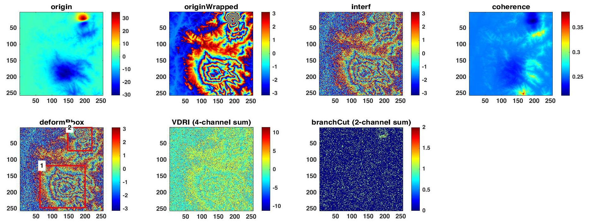

# Interferogram Simulator

This code provides a dataset simulation method that can provide training samples with strong generalization ability for model training. Deep learning, as a data-driven method, requires a large number of training samples to train network models. However, it is difficult or even impossible to obtain ground truth corresponding to InSAR data because it is difficult to collect high-resolution ground deformation information, which limits the application of deep learning in the field of InSAR. We study the phase characteristics of a large number of real interferograms, analyze the statistical models of InSAR data and noise sources, and propose a strategy to construct training samples by simulating the phase components of terrain, buildings, deformation, atmosphere, water surface and noise separately, which is applicable to training networks for different tasks such as **interferogram denoising**, **deformation detection** and **phase unwrapping**. Experimental results show that this dataset simulation method can effectively train deep network models with good generalization ability on real data.

## **Tutorial**

The code is based on **MATLAB**, make sure MATLAB is installed.

1. Clone the repo:

   ~~~shell
   git clone https://github.com/Wu-Patrick/InterferogramSimulator.git
   cd InterferogramSimulator
   ~~~

2. Run with MATLAB:

   ~~~shell
   main.m
   ~~~
3. You can easily modify the parameters to obtain different data sets.

   ~~~matlab
   %%% Control parameters %%%%%%%%%%%%%%%%%%%%%%%%%%%%%%%%%%%%%%%%%%%%%%%%%%%%
   params.savePath = 'data/test';
                                   % Data saving path
   params.totalNum = 50;           % Total number of samples
   params.sampleSize = 256;        % Size of generated sample
   params.multilook = [1,4];       % multilook [Azimuth, Range]
   params.demFolder = 'DEM/unzip';
                                   % Folder path containing multiple DEM (*.tif format)
                                   % You can download DEM files from: https://srtm.csi.cgiar.org/srtmdata/
   
   %%% output %%%%%%%%%%%%%%%%%%%%%%%%%%%%%%%%%%%%%%%%%%%%%%%%%%%%%%%%%%%%%%%%
   params.savePNGFlag = 1;         % Save the *.png image corresponding to the data
   params.out.origin = 1;          % Original phase
   params.out.originWrapped = 1;   % Wrapped version of the original phase, i.e., noise-free interferogram
   params.out.interf = 1;          % Simulated interferogram
   params.out.coherence = 1;       % Estimated coherence
   params.out.deformBbox = 1;      % Location and category of deformation area
   params.out.VDRI = 1;            % Horizontal phase gradient + residual map
                                   % + vertical phase gradient + interferogram (4 channels)
   params.out.branchCut = 1;       % Horizontal branch-cut and vertical branch-cut (2 channels)
   % You can customize other types of output and implement them in "generateOne.m".
   
   %%% Add phase components with a certain probability (0-1) %%%%%%%%%%%%%%%%%
   params.probSlop = 0.1;          % Slope phase
   params.probBuilding = 0.2;      % Building phase
   params.probTurbulence = 0.8;    % Atmospheric turbulence phase, i.e., fractal Perlin noises
   params.probDeform = 0.2;        % Distorted two-dimensional Gaussian surface
   params.probEarthquake = 0.2;    % Deformation caused by earthquakes
   params.probWater = 0.5;         % Completely decorrelated area (water area)
   
   params.noiseType = 0;           % 0 : Deformation-related noise
                                   % 1 : Noise with random signal-to-noise ratio, not recommended
   params.noiseSNRRange = [0.2,5]; % Need to specify when noiseType=1
   % Other parameters can be modified in the source code.
   
   %%% Parallel %%%%%%%%%%%%%%%%%%%%%%%%%%%%%%%%%%%%%%%%%%%%%%%%%%%%%%%%%%%%%%
   params.Parallel = 1;
   ~~~

## Examples

## Citation

If you use this code, please cite the following:
~~~BibTeX
@ARTICLE{9583246,
  author={Wu, Zhipeng and Wang, Teng and Wang, Yingjie and Wang, Robert and Ge, Daqing},
  journal={IEEE Transactions on Geoscience and Remote Sensing}, 
  title={Deep-Learning-Based Phase Discontinuity Prediction for 2-D Phase Unwrapping of SAR Interferograms}, 
  year={2022},
  volume={60},
  number={},
  pages={1-16},
  doi={10.1109/TGRS.2021.3121906}}
  
@ARTICLE{9583229,
  author={Wu, Zhipeng and Wang, Teng and Wang, Yingjie and Wang, Robert and Ge, Daqing},
  journal={IEEE Transactions on Geoscience and Remote Sensing}, 
  title={Deep Learning for the Detection and Phase Unwrapping of Mining-Induced Deformation in Large-Scale Interferograms}, 
  year={2022},
  volume={60},
  number={},
  pages={1-18},
  doi={10.1109/TGRS.2021.3121907}}
~~~

